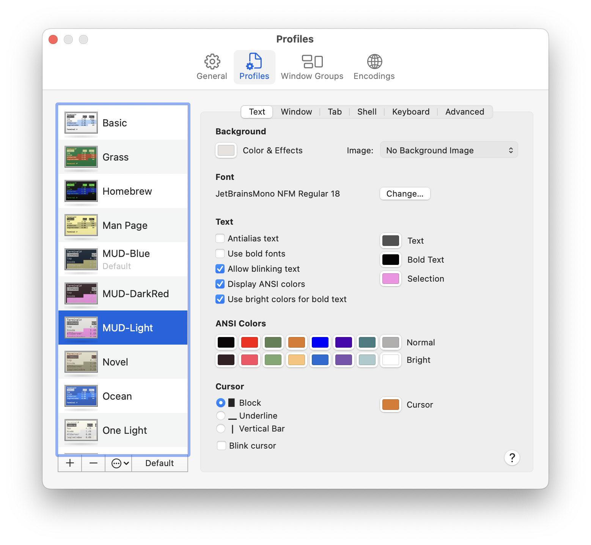
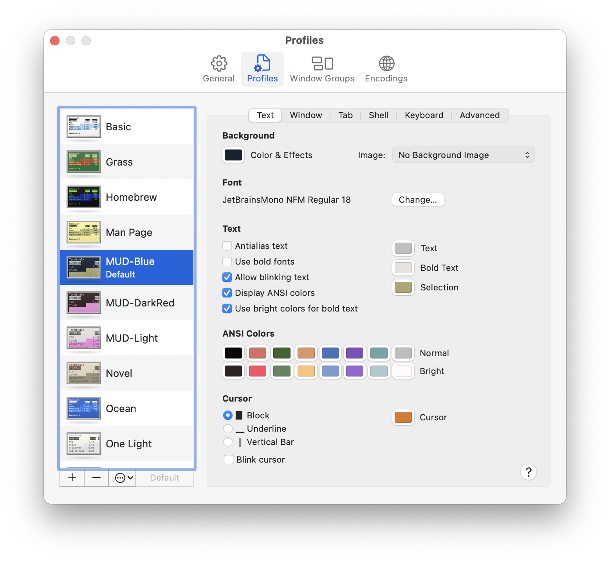
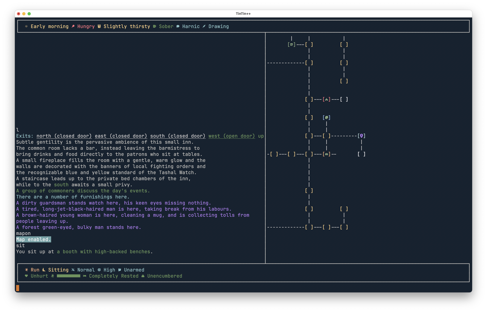

# Harshlands MUD TinTin++ Scripts
Disclaimer: These may not work on Windows yet, I'll put some time into making them more cross platform eventually. In the meantime feel free to make a pull request :)

## Table of Contents

- [Prerequisites](#prerequisites)
- [Configuration](#configuration)
- [Play](#play)
- [Screenshots](#screenshots)
- [Mapping](#mapping)
- [Credits](#credits)

## Prerequisites (required)

### Get TinTin++
https://tintin.mudhalla.net

These are TinTin++ scripts (.tin) They will not work with any other MUD/MUSH client.

### Install a NerdFont
https://www.nerdfonts.com

If you're not familiar with NerdFonts, they are font files that include myriad icons as characters.

Without a NerdFont your prompts will look messed up. 

There are a variety to choose from, I personally use _JetBrainsMono Nerd Font_.

### Install these scripts

Using git:
`git clone git@github.com:strnglp/harshlands.git ~/Harshlands` 

Downloading a release zip:

On the right side of this github repository page you should see the latest **Releases**.

Download and exract `Sources.zip` to `$HOME/Harshlands`

## Configuration
### NerdFont (required)
Change your terminal emulator's default font to the NerdFont you just installed.

### Login (required)
The only essential configuration required is inside `Login.tin`. Add your username and password there, or just delete those lines if you prefer to type them at login every time.

### Prompt (required)
1. Type `set barprompt` until you see `Bar Prompt enabled.`
2. Type `set prompt` until you see `Informative prompt enabled.`

### Optional configuration

#### PC Nicknames
Check out `PCs.tin` for an example of how you can highlight people you know and add nicknames.

#### Highlights
`HL.tin` is where the vast majority of specialized highlighting is done. This is probably the place you want to go to add new highlight expressions. Check out TinTin++ documentation or ask in Discord for help if you're not regex and TinTin++ savvy.

#### Colorscheme
Don't like the colors in use? Change them in your terminal settings, **not the script**!

These scripts were designed to utilize ANSI colors, here are some screenshots of where you change these colors for Terminal.app on MacOS. If you're using a different terminal emulator or operating system you probably have something like this in your preferences window.

You can look at `Global.tin` to get a general idea of how colors are organized if you wish.

_Note: TinTin++ supports vastly more colors than the 16 ANSI colors I chose to use, if you want to get creative, you can read the manual and change them to your liking._

## Play
**In your terminal type:**
`tt++ ~/Harshlands/Harshlands.tin` **to play Harshlands!**

> If you're playing and you want to pause the update of your prompts you can do so with `polloff` and you can turn it back on with `pollon`. Some activities in game are setup to do this automatically, such as reading multi-page helpfiles or submitting pmail or typos.

## Screenshots

## HUD
The HUD should automatically start after you login. It updates every 3 seconds if the circular indicator ◉ in the bottom right is green.

You can control polling for the HUD with the following:
- `pollon` To start the HUD polling
- `polloff` To stop the HUD polling

There is an effort to disable polling while the game asks for extended input, such as submitting typos or reading help files that have multiple pages.

#### Disclaimer
This is an imperfect solution. There are a couple of known bugs which I consider minor.
1. When polling is off, the HUD can sometimes show garbage, this is resolved by sending `pollon`
2. The auto-polloff for multi-page help sometimes doesn't work perfectly and you'll need to ask for help twice to get the rest of the pages.
3. Occasionally my substitutions will fail to suppress a part of the `profile t` reply, so you might see a part of it in the scroll region. This happens very rarely.

I have high confidence I can and will fix these minor issues over time.

#### Unknowns
I have limited experience with Harshlands, there is a good chance I am missing handling for certain strings that may appear in the player profile. In particular I am not sure if I'm correctly handling piety yet.
If you find something is broken please submit a PR or at least an example of the problem so we can debug it together.

## Mapping
The script will create a map file for you if you don't have a `MyMap.map` in your `~/Harshlands` directory.

#### Disclaimer
Mapping in TinTin++ is complex and _highly_ error prone. If you are not technically minded this will be an exercise in futility for you. In which case I recommend disabling the map and is why I have left it off by default.

### If you wish to enable the map do the following
1. `enter cart` at one of the carts in Tashal
2. Type `mapon` *# This will split the sreen and turn the map on*
3. Type `arrive market` *# This will align the map with your location*
4. Type `#map write $map` *# This saves your position in the map file*
5. Change the last line in HUD.tin to `maptop` instead of `mapoff`  *# Launches the map at startup so you don't fall out of alignment*

#### Second Disclaimer
It's really difficult to use a mapper with Harshlands and will absolutely require a lot of tinkering. Read the [mapping help](https://tintin.mudhalla.net/manual/mapping.php) and consider joining the [TinTin Discord](https://discord.gg/gv7a37n) for assitance.

## Credits
These scripts were derived from MarshalDFX's work: https://github.com/mdfx01/ArmageddonMUD/

I have a similarly derived work for Armageddon located here:
https://github.com/strnglp/armageddon
